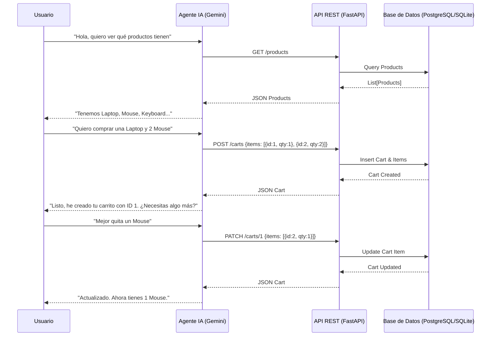

# Arquitectura del Agente de Ventas Laburen

## Diagrama de Flujo

## Componentes

1.  **Agente IA (Cliente)**:
    -   Implementado en Python usando `langgraph` y `langchain-google-genai`.
    -   Utiliza el modelo **Gemini 2.5 Flash**.
    -   Interactúa con el usuario vía consola (fase actual).
    -   Consume la API REST mediante llamadas HTTP (Tools).

2.  **API REST (Backend)**:
    -   Framework: **FastAPI**.
    -   Endpoints para gestión de productos y carritos.
    -   Documentación automática en `/docs`.

3.  **Base de Datos**:
    -   **SQLite** para desarrollo local (fácil despliegue).
    -   Compatible con **PostgreSQL** mediante cambio de connection string en `database.py`.
    -   ORM: **SQLAlchemy**.

4.  **Datos**:
    -   Carga inicial desde `products.xlsx` mediante script de seed.
